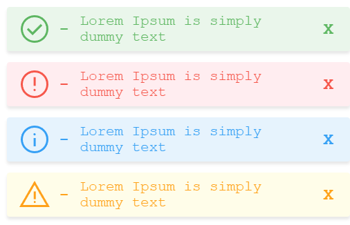

# simple-toast-messages

[](https://badge.fury.io/js/simple-toast-messages)
[](https://github.com/josunlp/simple-toast-messages/issues)
[](https://github.com/josunlp/simple-toast-messages/network)
[](https://github.com/josunlp/simple-toast-messages/stargazers)
[](https://github.com/josunlp/simple-toast-messages/blob/master/LICENSE)

[](https://www.codefactor.io/repository/github/josunlp/simple-toast-messages)
[](https://www.typescriptlang.org/)

A simple TypeScript package that builds up a messaging system.

## Installation

```bash
npm install simple-toast-messages
```

## Usage

```typescript
import SimpleToastMessages from 'simple-toast-messages';
import { SimpleToastMessages, stm, T } from 'simple-toast-messages';

const msg = SimpleToastMessages.getInstance();
msg.success(message, 1000);
msg.error(message);
msg.info(message, 2000);
msg.warning(message, 5000);
```



## License

[MIT](https://opensource.org/licenses/MIT)
