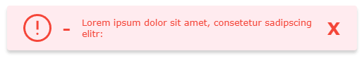
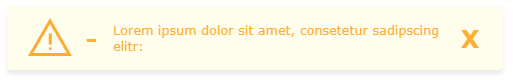

# simple-toast-messages

[](https://www.npmjs.com/package/simple-toast-messages)
[](https://github.com/josunlp/simple-toast-messages/issues)
[](https://github.com/josunlp/simple-toast-messages/network)
[](https://github.com/josunlp/simple-toast-messages/stargazers)
[](https://github.com/josunlp/simple-toast-messages/blob/master/LICENSE)

[](https://www.codefactor.io/repository/github/josunlp/simple-toast-messages)
[](https://www.typescriptlang.org/)

A simple TypeScript package that builds up a toast messaging system.

## Installation

```bash
npm install simple-toast-messages
```

## Usage

### Possible Imports

```typescript
// default import
import SimpleToastMessages from 'simple-toast-messages';

// named imports
import { SimpleToastMessages, stm, T, PositionEnum } from 'simple-toast-messages';
```

---

### Example

```typescript
// get the instance
const msg = SimpleToastMessages.getInstance();

// fire a success message with a timeout of 1 second and position top left
msg.success(message, {
  timeOut: 1000,
  position: PositionEnum.TOP_LEFT,
});

// fire a simple error message
msg.error(message);

// fire a info message with a timeout of 3 seconds and position bottom left
msg.info(message, {
  timeOut: 3000,
  position: PositionEnum.BOTTOM_LEFT,
  opacity: 0.8,
});

// fire a warning message with a timeout of 5 seconds and position bottom center
msg.warning(message, {
  timeOut: 5000,
  position: PositionEnum.BOTTOM_CENTER,
  opacity: 0.8,
});
```






## License

[MIT](https://opensource.org/licenses/MIT)
